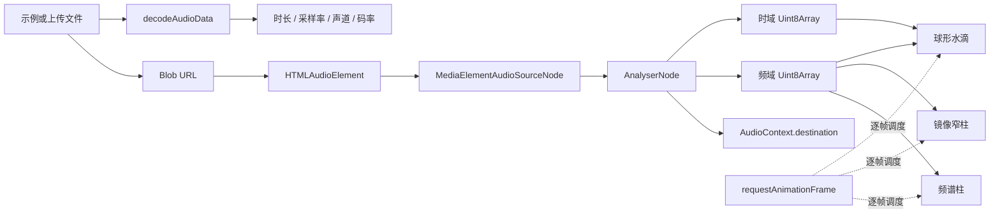

# 音乐解析与可视化实现文档

本文档说明 `/music/audio-visualizer` 的目录组织、音频解析链路、Canvas 绘制算法、性能设计，以及开发过程中遇到的问题和解决方式。

目标是让后续维护者可以快速回答下面几个问题：

- 音频如何从文件变成可以绘制的频域和时域数据？
- 普通频谱柱、镜像波形和球形水滴分别如何实现？
- 镜像波形为什么不会再出现杂乱的原始折线？
- 频率、颜色、柱宽、平滑速度应该在哪里调整？
- 如何增加第四种可视化模式？

## 1. 功能范围

当前页面支持：

- 加载内置示例音乐。
- 上传 MP3、WAV、M4A、AAC、OGG、FLAC 等浏览器可解码音频。
- 播放、暂停、归零、拖动进度和调整音量。
- 解析时长、采样率、声道数、文件大小和估算码率。
- 展示七段彩色频谱图例。
- 切换三种 Canvas 可视化模式：
  - 频谱柱。
  - 中线对称的镜像窄柱波形。
  - 球形水滴波纹。
- 调整可视化灵敏度，但不改变真实播放音量。

页面路由：

```text
/music/audio-visualizer
```

路由入口分别定义在：

- `src/site-map.tsx`：菜单层级、名称和 URL。
- `src/routes.ts`：URL 对应的懒加载页面组件。

## 2. 目录结构

```text
src/pages/music/audio-visualizer/
├── README.md                         # 本文档
├── index.tsx                         # 页面状态协调层
├── audio-visualizer.tsx              # Canvas 生命周期和绘制器调度
├── use-audio-analyser.ts             # 音频加载、解码、播放和 Web Audio 图
├── frequency-bands.ts                # 七频段、颜色和对数频率映射
├── formatters.ts                     # 时长、文件大小、声道格式化
├── style.module.scss                 # 页面和响应式样式
├── components/
│   ├── visualizer-toolbar.tsx        # 音轨信息、模式切换、文件选择
│   ├── visualizer-stage.tsx          # Canvas 舞台、状态和解析遮罩
│   ├── player-controls.tsx           # 播放、进度和音量控件
│   └── audio-inspector.tsx           # 元数据、灵敏度和频段图例
└── visualizers/
    ├── types.ts                      # scene、frame、state 和模式类型
    ├── canvas-utils.ts               # 网格、边界限制和 FFT 采样工具
    ├── draw-bars.ts                  # 普通频谱柱
    ├── draw-mirror-spectrum.ts       # 镜像窄柱与正弦包络
    └── draw-orb.ts                   # 球形波纹和水滴粒子
```

项目采用“菜单目录和物理目录一致”的组织原则：

- 语音识别、语音合成和 AudioContext 位于 `src/pages/speech/`。
- MediaDevices、图片视频预览和 MediaRecorder 位于 `src/pages/media/`。
- 音乐解析和可视化位于 `src/pages/music/`。

这样可以直接从 URL 推断源码位置，例如 `/music/audio-visualizer` 对应 `src/pages/music/audio-visualizer/`。

## 3. 总体数据流



这里存在两条不同用途的链路：

1. 文件解析链路

   `File -> ArrayBuffer -> AudioBuffer`

   负责取得音频元数据，不负责实际播放。

2. 播放分析链路

   `HTMLAudioElement -> MediaElementSource -> AnalyserNode -> destination`

   负责播放声音，并在播放过程中持续提供实时频域和时域数据。

## 4. 音频加载与 Web Audio

核心文件：`use-audio-analyser.ts`

### 4.1 文件加载

加载文件时依次执行：

1. 暂停旧音频并重置播放状态。
2. 释放旧的 Blob URL。
3. 使用 `URL.createObjectURL(file)` 生成播放器地址。
4. 将地址写入隐藏的 `<audio>` 元素。
5. 创建临时 `AudioContext`，调用 `decodeAudioData()`。
6. 从 `AudioBuffer` 读取时长、采样率和声道数。
7. 完成后关闭临时解码上下文。

估算码率使用：

```text
bitRate(kbps) = 文件字节数 * 8 / 时长秒数 / 1000
```

它是整段文件的平均估算值，不代表音频编码器中的瞬时码率。

### 4.2 避免异步文件覆盖

用户可能连续选择多个文件，较早文件的解码反而较晚结束。

解决方法是使用递增的 `loadIdRef`：

```text
开始加载 -> loadId + 1 -> 保存为本次任务编号
解码完成 -> 只有任务编号仍等于最新编号才更新状态
```

页面还使用 `hasSelectedFileRef`，避免尚在下载的内置示例覆盖用户主动选择的文件。

### 4.3 创建播放分析图

分析图只在用户首次点击播放时创建：

```text
HTMLAudioElement
    -> MediaElementAudioSourceNode
    -> AnalyserNode
    -> AudioContext.destination
```

这样做有两个原因：

- 浏览器通常要求在用户手势中创建或恢复 `AudioContext`。
- 同一个 `HTMLAudioElement` 只能创建一次 `MediaElementAudioSourceNode`。

因此 `AudioContext`、`MediaElementSource` 和 `AnalyserNode` 都保存在 ref 中重复使用。

### 4.4 AnalyserNode 参数

| 参数 | 当前值 | 作用 |
| --- | ---: | --- |
| `fftSize` | `8192` | 提高低频分辨率，减少多根低频柱高度相同的问题 |
| `frequencyBinCount` | `4096` | 频域数组长度，始终等于 `fftSize / 2` |
| `minDecibels` | `-92` | 将更弱的信号压到可视化底部 |
| `maxDecibels` | `-12` | 保留顶部空间，减少强信号持续满高 |
| `smoothingTimeConstant` | `0.72` | 抑制抖动，同时保留节拍响应 |

FFT 的单个 bin 频率宽度为：

```text
HzPerBin = sampleRate / fftSize
```

以 44.1 kHz 采样率为例：

```text
44100 / 8192 ≈ 5.38 Hz/bin
```

如果使用较小的 `fftSize`，20-60 Hz 的次低频只能落入很少的 bin，相邻低频柱就很容易得到相同高度。

### 4.5 播放状态来源

React 状态不猜测播放器是否播放，而是以 `<audio>` 事件作为最终事实来源：

- `play`：设置播放中。
- `pause`：设置暂停。
- `ended`：恢复播放按钮。
- `timeupdate`：读取真实播放进度。
- `loadedmetadata`：校正总时长。

### 4.6 资源清理

组件卸载时必须：

- 使未完成的解码任务失效。
- `URL.revokeObjectURL()` 释放 Blob URL。
- 断开 `MediaElementSourceNode`。
- 断开 `AnalyserNode`。
- 关闭持久 `AudioContext`。

## 5. Canvas 驱动层

核心文件：`audio-visualizer.tsx`

该组件只负责四件事：

1. 创建和缩放 Canvas。
2. 每帧读取 AnalyserNode 数据。
3. 组装绘制器参数。
4. 根据模式调用对应绘制器。

具体绘制算法不再放在 React 组件中。

### 5.1 为什么使用对象传参

早期绘制函数需要传入 7-12 个位置参数，例如上下文、宽高、两个数组、灵敏度、采样率、FFT 尺寸和粒子状态。主要问题是：

- 参数顺序难记。
- 调用处难以阅读。
- 新增字段会修改所有调用位置。
- 曾经出现 `sampleRate`、`fftSize` 放错绘制分支的问题。

现在统一使用三个对象：

```ts
drawRenderer(scene, frame, state);
```

| 对象 | 内容 | 生命周期 |
| --- | --- | --- |
| `scene` | Canvas context、CSS 宽度、高度 | 当前绘制帧 |
| `frame` | 频域、时域、采样率、FFT、灵敏度、播放状态、时间戳 | 当前绘制帧 |
| `state` | 峰值、镜像高度或水滴粒子 | 跨动画帧 |

### 5.2 每帧执行顺序

```text
requestAnimationFrame
    -> 读取最新 AnalyserNode
    -> 必要时重建 Uint8Array
    -> getByteFrequencyData
    -> getByteTimeDomainData
    -> 清空 Canvas
    -> 填充背景
    -> 调用当前模式绘制器
    -> 预约下一帧
```

### 5.3 高 DPI 与响应式尺寸

Canvas 的 CSS 尺寸和物理像素尺寸是两套尺寸。

实现中使用 `ResizeObserver` 监听容器变化，并执行：

```text
物理宽度 = CSS 宽度 * min(devicePixelRatio, 2)
物理高度 = CSS 高度 * min(devicePixelRatio, 2)
```

之后通过 `context.setTransform()` 将绘制单位恢复为 CSS 像素。

像素比限制为 2，是在高分屏清晰度和每帧绘制成本之间取平衡。

## 6. 频率采样和颜色

核心文件：

- `frequency-bands.ts`
- `visualizers/canvas-utils.ts`

### 6.1 七段频谱

原来只有低、中、高三段，相邻颜色和频率含义都不够详细。现在拆为七段：

| 频段 | 范围 | 颜色 | 常见听感 |
| --- | --- | --- | --- |
| 次低频 | 20-60 Hz | 紫色 `#9b6dff` | 下潜、震动、超低音 |
| 低频 | 60-250 Hz | 蓝色 `#3b82f6` | 鼓点、贝斯主体 |
| 中低频 | 250-500 Hz | 青色 `#00c2d7` | 厚度、温暖感 |
| 中频 | 500 Hz-2 kHz | 绿色 `#2ccb7f` | 人声和多数乐器主体 |
| 中高频 | 2-4 kHz | 黄色 `#f2c94c` | 清晰度、存在感 |
| 高频 | 4-8 kHz | 橙色 `#ff8a34` | 明亮度、打击细节 |
| 超高频 | 8-20 kHz | 红色 `#f04452` | 空气感、泛音 |

颜色按照紫、蓝、青、绿、黄、橙、红展开，避免中频和高频在画布上难以区分。

### 6.2 对数频率轴

人耳对频率的感知更接近对数关系。如果使用线性频率轴，20-500 Hz 会挤在画布最左侧。

当前映射为：

```text
frequency = minFrequency * (maxFrequency / minFrequency) ^ progress
```

其中：

- `minFrequency = 20 Hz`
- `maxFrequency = min(20000 Hz, sampleRate / 2)`
- `progress` 为画布水平方向的 0-1 位置

### 6.3 FFT bin 线性插值

实际频率通常不会刚好落在整数 bin 上。直接使用 `floor(index)` 会让多个相邻柱读取同一个 bin。

当前做法：

```text
exactIndex = frequency * fftSize / sampleRate
value = leftBin * (1 - fraction) + rightBin * fraction
```

这能减少低频柱出现大片相同高度的情况。

## 7. 三种可视化算法

### 7.1 普通频谱柱

核心文件：`visualizers/draw-bars.ts`

实现步骤：

1. 按画布宽度动态生成 36-112 根柱。
2. 将每根柱映射到 20 Hz-20 kHz 对数频率。
3. 使用 FFT bin 插值读取幅度。
4. 使用 `amplitude ^ 1.28` 压缩弱信号并控制视觉层次。
5. 按七频段设置颜色。
6. 保存每根柱的峰值，并以每帧 1.8px 的速度衰减。
7. 在底部绘制短倒影和基线。

画布顶部强制保留 44px。这个限制解决了强信号或高灵敏度时柱子与画布顶部齐平、看起来空间不足的问题。

### 7.2 镜像窄柱波形

核心文件：`visualizers/draw-mirror-spectrum.ts`

#### 设计目标

- 以 Canvas 垂直中心为基线。
- 上下严格对称。
- 外观类似频谱柱，但柱子更窄、更密集。
- 轮廓接近连续的三角函数波形。
- 动画仍然由真实音乐驱动，而不是播放与音乐无关的装饰动画。

#### 为什么不再使用原始时域折线

原始实现直接读取 `getByteTimeDomainData()`，将每个时域采样的绝对值连接起来。真实音乐通常由大量不同频率叠加，短时间窗口中的采样会快速正负变化，因此直接连线必然呈现细碎、杂乱的锯齿。

现在镜像模式改为使用 FFT 频域数据：

- 横轴表示从低到高的频率。
- 柱高表示当前频率能量。
- 每根柱从 `baseline - level` 画到 `baseline + level`。

因此它既保留了音乐响应，又天然适合规整的上下对称构图。

#### 第一步：动态窄柱

```text
barCount = clamp(drawableWidth / 4.5, 64, 180)
barWidth = clamp(slotWidth * 0.34, 1, 2)
```

普通频谱柱需要强调独立柱体，镜像模式则使用 1-2px 圆头线段，形成更细密的波形轮廓。

#### 第二步：空间平滑

每根柱会读取左右各四根柱，一共最多九个采样，并使用三角权重：

```text
距离当前柱 0：权重 5
距离当前柱 1：权重 4
距离当前柱 2：权重 3
距离当前柱 3：权重 2
距离当前柱 4：权重 1
```

公式可以概括为：

```text
smooth[i] = Σ(level[i + offset] * weight[offset]) / Σ(weight[offset])
```

它去掉孤立尖刺，但比简单的大范围平均更能保留主要频谱走势。

#### 第三步：宽频段能量

镜像模式额外统计：

- `bassEnergy`：20-250 Hz
- `midEnergy`：250 Hz-4 kHz
- `highEnergy`：4-20 kHz

七段频谱负责颜色和细节，三个宽频段负责控制不同正弦谐波的参与强度。

#### 第四步：正弦谐波包络

当前轮廓叠加三层正弦波：

```ts
0.78
+ sin(progress * PI * 4  - phase)       // 宽低频波峰
+ sin(progress * PI * 10 + phase * 1.35) // 中频波峰
+ sin(progress * PI * 18 - phase * 1.8)  // 高频细节
```

每层正弦的幅度分别受低频、中频和高频能量控制。

注意：正弦函数只整理外轮廓，真实 FFT 能量仍然是最终高度的主体。

#### 第五步：整体构图包络

为了避免左右两端与中间一样满，额外使用：

```text
compositionEnvelope = 0.7 + sin(progress * PI) ^ 0.55 * 0.3
```

这样两端略低、中间更饱满，整个波形更接近完整的音乐可视化构图。

#### 第六步：目标高度

```text
targetLevel =
    smoothFFT ^ 1.12
    * maximumAmplitude
    * sensitivity
    * harmonicEnvelope
    * compositionEnvelope
```

结果会被限制在 2px 到最大可用高度之间，上下保留 46px 安全空间。

#### 第七步：跨帧缓动

只做空间平滑仍会闪烁，因此每根柱保存上一帧高度：

```text
level = previous + (target - previous) * easing
```

- 上升：`easing = 0.34`，快速跟随鼓点。
- 下降：`easing = 0.13`，缓慢回落，减少跳变。

这两个速度不同，形成“快攻、慢释放”的视觉效果。

### 7.3 球形水滴波纹

核心文件：`visualizers/draw-orb.ts`

球形模式将不同数据映射到不同视觉层：

| 数据 | 视觉作用 |
| --- | --- |
| 20-250 Hz 低频能量 | 球体脉冲、外围扩散波纹、水滴触发 |
| 250 Hz-4 kHz 中频能量 | 球内水纹透明度 |
| 4-20 kHz 高频能量 | 球内椭圆水纹振幅 |
| FFT 频域 | 球形外轮廓的径向扩张 |
| 时域数据 | 外轮廓的小尺度细节 |

球形模式包括四层：

1. 循环扩散的外围圆环。
2. 径向渐变形成的球体体积。
3. 裁切在球内的流动椭圆水纹。
4. 受低频触发并向外飞散的水滴粒子。

水滴使用 `OrbState` 保存生命周期、距离、尺寸和速度。只有播放中且低频超过阈值时才生成，并限制至少间隔 110ms，防止粒子数量失控。

## 8. React 组件拆分与性能

页面入口 `index.tsx` 只保留：

- 音频 Hook 调用。
- 当前模式和灵敏度状态。
- 内置示例加载。
- 用户文件选择协调。
- 子组件组合。

界面组件职责如下：

| 组件 | 职责 |
| --- | --- |
| `VisualizerToolbar` | 文件选择和模式切换 |
| `VisualizerStage` | Canvas、运行状态、解析遮罩 |
| `PlayerControls` | 播放、进度、音量 |
| `AudioInspector` | 元数据、灵敏度、频段图例 |

这些组件使用 `React.memo`。播放过程中 `currentTime` 持续变化时：

- `PlayerControls` 正常更新。
- 工具栏不重复渲染。
- 分析面板不重复渲染。
- Canvas 舞台不因 React 播放进度更新而重复渲染。
- Canvas 动画继续由自己的 `requestAnimationFrame` 驱动。

Canvas 跨帧数据放在 ref 中，而不是 React state 中。否则每个动画帧都触发 React render，性能会明显下降。

## 9. 遇到的问题与解决方式

### 9.1 菜单分组和物理文件位置不一致

问题：语音、媒体功能原来在菜单或目录中分散，难以通过 URL 推断源码位置。

解决：

- 语音功能统一到 `/speech` 和 `src/pages/speech/`。
- 媒体功能统一到 `/media` 和 `src/pages/media/`。
- 音乐功能新增 `/music` 和 `src/pages/music/`。

### 9.2 三段频谱不够详细且颜色接近

问题：低频、中频、高频只能表达大致范围，中频和高频颜色不容易快速区分。

解决：拆为七段，并使用跨色相的紫、蓝、青、绿、黄、橙、红。

### 9.3 频谱柱贴住 Canvas 顶部

问题：高灵敏度或强信号会让柱子和顶部齐平，看起来画布高度不足。

解决：普通频谱柱顶部保留 44px，镜像模式上下分别保留 46px，并对最大高度做硬限制。

### 9.4 次低频和低频多根柱高度相同

问题原因：

- FFT 尺寸较小时，低频 bin 太少。
- 多个对数频率位置可能读取同一个整数 bin。

解决：

- 将 `fftSize` 提高到 8192。
- 在相邻 bin 之间线性插值。
- 对数频率轴为低频分配更多水平空间。

### 9.5 镜像时域波形杂乱

问题：直接连接原始时域采样会忠实呈现复杂声波，但不适合作为规整的视觉图谱。

解决：

- 镜像模式改用 FFT 频域能量。
- 改为 1-2px 的细密对称柱。
- 增加九点三角权重空间平滑。
- 使用受音乐能量控制的正弦谐波包络。
- 使用快升慢降的跨帧缓动。

### 9.6 普通柱状图和镜像模式动画观感变差

问题：增加频段后，如果直接对每段求同一个平均值，段内所有柱会使用相同高度，动画看起来像整块升降。

解决：颜色按频段归类，但每根柱仍按自己的精确 Hz 从 FFT 数据插值取样。频段只决定颜色，不决定整段共同高度。

### 9.7 绘制函数参数过长

问题：位置参数过多，调用处难读，并容易将 `sampleRate`、`fftSize` 传错分支。

解决：统一为 `scene / frame / state` 三个对象，并把各模式算法拆成独立文件。

### 9.8 播放进度导致整个页面重复渲染

问题：`timeupdate` 会持续更新 `currentTime`，页面内所有 JSX 都会重新执行。

解决：抽离组件并使用 `React.memo`，让无关区域跳过渲染。

### 9.9 Canvas 在高分屏模糊或缩放后尺寸不正确

问题：只设置 CSS 宽高时，Canvas 物理缓冲区可能不足；侧栏和窗口变化也会改变可用尺寸。

解决：使用 `ResizeObserver` 和受限 DPR 同步物理尺寸，再用 `setTransform()` 恢复 CSS 像素坐标。

## 10. 常用调参位置

### 10.1 镜像波形

文件：`visualizers/draw-mirror-spectrum.ts`

| 参数 | 当前值 | 调大后的效果 |
| --- | ---: | --- |
| `SMOOTHING_RADIUS` | `4` | 轮廓更平滑，但频谱细节减少 |
| `drawableWidth / 4.5` | 动态 | 除数越小，柱子越多 |
| `barWidth` 上限 | `2px` | 单根柱更粗 |
| 正弦 `PI * 4` | 2 个完整周期 | 低频宽波峰更多 |
| 正弦 `PI * 10` | 5 个完整周期 | 中频波峰更多 |
| 正弦 `PI * 18` | 9 个完整周期 | 高频细节更密 |
| 上升 easing | `0.34` | 响应更快 |
| 下降 easing | `0.13` | 回落更快、拖尾更少 |
| 上下安全空间 | `46px` | 波形离边缘更远 |

调参原则：

- 想要更整齐：先增加 `SMOOTHING_RADIUS`，不要先降低 FFT 尺寸。
- 想要更细密：增加柱数，但保持 `barWidth <= 2px`。
- 想要更跟拍：增加上升 easing 或低频正弦权重。
- 想要更稳定：减小正弦权重或减小下降 easing。
- 想保留真实音乐关系：不要让正弦包络权重大于 FFT 主高度。

### 10.2 普通频谱柱

文件：`visualizers/draw-bars.ts`

常用参数：

- `width / 11`：柱数量密度。
- `gap`：柱间距。
- `amplitude ^ 1.28`：幅度曲线。
- `1.8px/frame`：峰值下降速度。
- `44px`：顶部安全空间。

### 10.3 分析器

文件：`use-audio-analyser.ts`

常用参数：

- `fftSize`：频率精度和计算成本。
- `smoothingTimeConstant`：原始 AnalyserNode 平滑程度。
- `minDecibels`、`maxDecibels`：幅度映射范围。

不要同时大幅提高 `smoothingTimeConstant` 和绘制器跨帧平滑，否则动画会明显滞后。

## 11. 增加新的可视化模式

增加第四种模式时按下面顺序操作：

1. 在 `visualizers/types.ts` 扩展 `VisualizationMode`。
2. 在 `VISUALIZATION_MODE_LABELS` 增加界面名称。
3. 在 `VISUALIZATION_MODE_ARIA_LABELS` 增加辅助说明。
4. 根据需要定义新的跨帧 state。
5. 在 `visualizers/` 新建独立的 `draw-xxx.ts`。
6. 绘制函数保持 `drawXxx(scene, frame, state)` 形式。
7. 在 `audio-visualizer.tsx` 创建 state ref 并增加调度分支。
8. 在 `components/visualizer-toolbar.tsx` 增加模式选项和图标。
9. 验证桌面和手机尺寸下的柱数、边距和文本宽度。

新绘制器不应直接操作 React state，也不应自己创建新的 `requestAnimationFrame`。

## 12. 调试与验证

### 12.1 本地运行

```bash
npm run dev
```

访问：

```text
http://127.0.0.1:<vite-port>/music/audio-visualizer
```

### 12.2 定向代码检查

```bash
npx eslint src/pages/music/audio-visualizer \
  --ext ts,tsx \
  --report-unused-disable-directives \
  --max-warnings 0
```

### 12.3 生产打包

```bash
npx vite build
```

### 12.4 浏览器检查清单

- 内置示例不会覆盖用户主动上传的文件。
- 首次点击播放后能够听到声音。
- 频谱柱顶部始终有留白。
- 七段颜色按低频到高频正确过渡。
- 镜像柱宽明显小于普通频谱柱。
- 镜像柱严格以中线为基准上下对称。
- 镜像轮廓连续，不出现原始时域锯齿。
- 球形模式可以正常切换，不出现 `sampleRate` 或 `fftSize` 未定义错误。
- 调整灵敏度只改变图形，不改变音量。
- 桌面、平板和手机宽度下控件不重叠。
- 切换页面后 AudioContext、Blob URL 和动画帧均被释放。

### 12.5 当前仓库检查说明

音乐模块的定向 ESLint、Vite 构建和 `git diff --check` 可以通过。

全仓 `tsc --noEmit` 目前仍会报告其他旧模块中的类型问题，主要位于：

- `src/components/virtual-list/`
- `src/pages/intersection-observer/virtual-list/`
- `src/pages/web-gpu/`
- `src/pages/web-worker/`

判断音乐模块是否引入 TypeScript 回归时，应重点确认输出中是否出现 `src/pages/music/audio-visualizer/`。

## 13. 核心结论

- 文件解码负责元数据，媒体分析图负责实时可视化，两条链路不要混合。
- Canvas 动画数据应保存在普通变量或 ref 中，不应每帧写入 React state。
- 频谱图适合使用 FFT 数据；原始时域数据更适合示波器，而不是规整的音乐频谱构图。
- 频段负责语义和颜色，每根柱仍应独立采样，不能让整段共用一个平均高度。
- 镜像波形的稳定性来自“FFT 插值 + 空间平滑 + 正弦包络 + 跨帧缓动”，四层分别解决不同问题。
- 绘制器使用统一对象协议后，新增模式只需要增加算法和一个调度分支，不需要修改音频读取链路。
