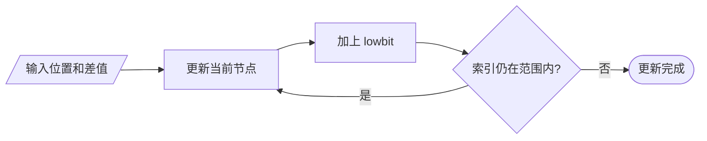
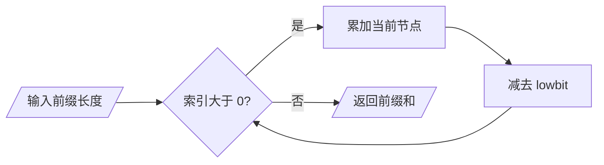
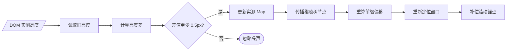

值

# Fenwick Tree 完全理解指南

Fenwick Tree 中文通常称为“树状数组”，也叫 Binary Indexed Tree，简称 BIT。它解决的核心问题是：

> 当一个数组既会频繁修改单个元素，又需要频繁查询前缀和时，如何让更新和查询都保持 O(log n)。

当前不定高度虚拟列表用它维护“实测高度相对预估高度的差值”，从而快速完成三件事：

1. 某一行真实高度变化后，O(log n) 更新累计高度。
2. 查询第 `index` 行之前的累计高度，O(log n) 得到渲染偏移。
3. 根据 `scrollTop` 反向定位所在行，使用 binary lifting 保持 O(log n)。

对应实现：[dynamic-height-virtualizer.ts](./dynamic-height-virtualizer.ts)。

> 第一次阅读时，先只读第 0～8 节。暂时不要管虚拟列表、稀疏 `Map` 和 binary lifting，先弄懂
> `tree[i]` 究竟保存什么、查询为什么向左跳、更新为什么向右跳。

## 0. 先别看 lowbit：把它当成“分块账本”

假设仓库连续 8 天收到这些货物：

```text
天数：       1  2  3  4  5  6  7  8
当天数量 A：  3  2  5  1  4  6  2  7
```

现在经常需要回答：“前 7 天一共收到多少？”

最直接的办法是把 7 个数重新相加：

```text
3 + 2 + 5 + 1 + 4 + 6 + 2 = 23
```

数据很多、查询频繁时，每次从头加太慢。于是额外准备一本账，提前保存一些连续区间的合计：

```text
tree[1] 保存第 1 天：          [1]       = 3
tree[2] 保存第 1～2 天：       [1, 2]    = 5
tree[3] 保存第 3 天：          [3]       = 5
tree[4] 保存第 1～4 天：       [1, 4]    = 11
tree[5] 保存第 5 天：          [5]       = 4
tree[6] 保存第 5～6 天：       [5, 6]    = 10
tree[7] 保存第 7 天：          [7]       = 2
tree[8] 保存第 1～8 天：       [1, 8]    = 30
```

有了这本账，前 7 天可以拆成三个互不重叠的块：

```text
[1, 7] = [1, 4] + [5, 6] + [7, 7]

prefix(7) = tree[4] + tree[6] + tree[7]
          = 11 + 10 + 2
          = 23
```

这就是 Fenwick Tree 最核心的想法：

> `A` 保存每一项原始数据，`tree` 重复保存精心选择的区间和。查询时拼少量区间，修改时修正所有
> 包含该项的区间。

它并不是一棵由对象和指针组成的树，实际仍是数组。所谓“树状”，只是这些区间存在包含关系。

## 1. 为什么需要 Fenwick Tree

先忽略虚拟列表，假设有一个数组：

```text
下标索引：   1  2  3  4  5  6  7  8
对应数值：   3  2  5  1  4  6  2  7
```

现在需要支持两种操作：

- 把第 5 个元素增加 3。
- 查询前 7 个元素之和。

常见结构的取舍如下：

| 数据结构       | 单点更新 | 前缀和查询 | 主要问题                       |
| -------------- | -------: | ---------: | ------------------------------ |
| 普通数组       |     O(1) |       O(n) | 每次查询都要从头累加           |
| 完整前缀和数组 |     O(n) |       O(1) | 修改一项后，后面的前缀都要更新 |
| Fenwick Tree   | O(log n) |   O(log n) | 只适合可累加、可求差的前缀问题 |
| Segment Tree   | O(log n) |   O(log n) | 能力更强，但代码和空间成本更高 |

虚拟列表滚动时会持续查询累计高度，图片加载和文本换行又会持续修改单项高度。普通数组和完整前缀
和数组都会让其中一条路径退化到 O(n)，因此需要 Fenwick Tree。

## 2. 先理解“前缀和”

数组 `A` 的前缀和定义为：

```text
prefix(i) = A[1] + A[2] + ... + A[i]
```

如果能快速计算 `prefix(i)`，就能得到任意区间和：

```text
range(left, right) = prefix(right) - prefix(left - 1)
```

在虚拟列表中，第 `index` 项顶部的偏移本质也是前缀和：

```text
offset(index) = height[0] + height[1] + ... + height[index - 1]
```

因此，虚拟列表的“根据索引求偏移”可以转换为“查询高度数组的前缀和”。

## 3. Fenwick Tree 的核心设计

Fenwick Tree 不让一个节点只保存一个元素，也不让一个前缀缓存后面所有元素。它让每个节点保存一段长度为 2 的幂的区间和。

节点 `tree[i]` 覆盖的区间为：

```text
[i - lowbit(i) + 1, i]
```

其中：

```ts
lowbit(i) = i & -i
```

对于 8 个元素，各节点覆盖范围如下：

| `i` |   二进制 | `lowbit(i)` | `tree[i]` 覆盖范围 | 保存的区间和 |
| ----: | -------: | ------------: | -------------------- | -----------: |
|     1 | `0001` |             1 | `[1, 1]`           |            3 |
|     2 | `0010` |             2 | `[1, 2]`           |            5 |
|     3 | `0011` |             1 | `[3, 3]`           |            5 |
|     4 | `0100` |             4 | `[1, 4]`           |           11 |
|     5 | `0101` |             1 | `[5, 5]`           |            4 |
|     6 | `0110` |             2 | `[5, 6]`           |           10 |
|     7 | `0111` |             1 | `[7, 7]`           |            2 |
|     8 | `1000` |             8 | `[1, 8]`           |           30 |

可以把它理解为下面的区间分层：

```text
tree[8]  [1 -------------------------------- 8]
tree[4]  [1 -------------- 4]
tree[2]  [1 ---- 2]        tree[6]  [5 ---- 6]
tree[1]  [1] tree[3] [3]   tree[5]  [5] tree[7] [7]
```

它不是真正用对象节点连接起来的树。“树状”关系由索引的二进制最低有效位隐式表达，所以底层仍然
可以使用数组；当前项目为了支持巨大逻辑数量，改用稀疏 `Map`。

### 3.1 怎样读懂一个 tree 节点

每个节点都遵循同一句话：

> `tree[i]` 保存一个以 `i` 结尾、长度为 `lowbit(i)` 的连续区间。

例如 `tree[6]`：

```text
lowbit(6) = 2
以 6 结尾、长度为 2 的区间是 [5, 6]
所以 tree[6] = A[5] + A[6] = 4 + 6 = 10
```

例如 `tree[4]`：

```text
lowbit(4) = 4
以 4 结尾、长度为 4 的区间是 [1, 4]
所以 tree[4] = A[1] + A[2] + A[3] + A[4] = 11
```

因此 `tree[6]` **不是前 6 项的和**。只有 1、2、4、8 这些 2 的幂，其节点区间才从 1 开始。

### 3.2 原数组与 tree 数组不是二选一

二者职责不同：

```text
A[i]：    第 i 项自己的值
tree[i]：以 i 结尾的某个区间的合计
```

同一个 `A[i]` 会出现在多个 tree 节点中。例如 `A[5]` 同时被计入：

```text
tree[5] 的 [5, 5]
tree[6] 的 [5, 6]
tree[8] 的 [1, 8]
```

这份有规律的重复存储，正是后面能快速更新和查询的原因。

## 4. lowbit 到底是什么

`lowbit(i)` 返回二进制表示中最低位的 `1` 所代表的数值。

```text
i = 6
二进制：0110
最低位的 1 位于 2^1
lowbit(6) = 2
```

为什么 `i & -i` 能得到它？在补码表示中，`-i` 会保留最低位的 `1`，并把它左边的位取反。以 4 位
形式展示：

```text
 i =  6 = 0110
-i = -6 = 1010
             ----
i & -i = 0010 = 2
```

再看几个例子：

```text
lowbit(1) = 1
lowbit(2) = 2
lowbit(3) = 1
lowbit(4) = 4
lowbit(6) = 2
lowbit(8) = 8
lowbit(12) = 4
```

`lowbit(i)` 同时表达两件事：

1. `tree[i]` 管理多少个原数组元素。
2. 更新或查询时，下一步应该跳多远。

### 4.1 不理解补码，也能先使用 lowbit

可以先把 `lowbit` 当作“这个节点管理的区间长度”。观察二进制末尾即可：

```text
末尾是 ...001：lowbit = 1，管理 1 项
末尾是 ...010：lowbit = 2，管理 2 项
末尾是 ...100：lowbit = 4，管理 4 项
末尾是 ..1000：lowbit = 8，管理 8 项
```

二进制末尾有几个 `0`，这个数就能被多大的 2 的幂整除。Fenwick Tree 借此让索引本身携带区间
长度，不再额外保存每个节点的覆盖范围。

## 5. 为什么必须使用 1-based 索引

Fenwick Tree 通常从 1 开始编号，因为：

```text
lowbit(0) = 0
```

如果更新循环从 0 开始：

```ts
index += lowbit(index);
```

那么 `index` 永远还是 0，循环无法前进。当前业务数组使用 0-based 索引，所以写入树时必须转换：

```ts
const treeIndex = itemIndex + 1;
```

查询第 `itemIndex` 项顶部偏移时，需要的是它之前 `itemIndex` 个元素的和，恰好可以把
`itemIndex` 直接作为 Fenwick 前缀长度使用。

业务索引与 Fenwick 索引的对应关系如下：

| 想表达的内容 |          业务 0-based |   Fenwick 1-based |
| ------------ | --------------------: | ----------------: |
| 第 1 项      |     `itemIndex = 0` |         位置`1` |
| 第 5 项      |     `itemIndex = 4` |         位置`5` |
| 更新第 5 项  | `add(4 + 1, delta)` | `add(5, delta)` |
| 第 5 项顶部  |           前面有 4 项 |  `prefixSum(4)` |
| 第 5 项底部  |     前面及自身共 5 项 |  `prefixSum(5)` |

最实用的记忆方式是：

```text
更新业务第 i 项：Fenwick 位置为 i + 1
查询业务第 i 项顶部：查询前 i 项，因此直接 prefixSum(i)
```

## 6. 单点更新是如何工作的

假设原数组第 5 个元素从 `4` 变为 `7`：

```text
索引值： 1  2  3  4  5  6  7  8
更新前： 3  2  5  1  4  6  2  7
更新后： 3  2  5  1  7  6  2  7
```

先计算原数组发生了多大变化：

```text
delta = 新 A[5] - 旧 A[5]
      = 7 - 4
      = 3
```

后面的 `tree[i] += 3` 中，数字 `3` 就来自这里。它不是根据 `tree[i]` 算出来的，而是 `A[5]`
自身的变化量。

所有覆盖范围包含位置 5 的 Fenwick 节点都必须增加同一个 `delta = 3`：

```text
5 -> 6 -> 8 -> 超出范围
```

路径计算规则：

```ts
index += index & -index;
```

下面不使用压缩表格，逐步计算。

### 第一步：更新 tree[5]

先算节点 5 管理多少项：

```text
lowbit(5) = 1
```

所以它管理的区间是：

```text
[5 - 1 + 1, 5] = [5, 5]
```

更新前：

```text
tree[5] = A[5] = 4
```

由于该区间包含发生变化的 `A[5]`，所以加上变化量 3：

```text
tree[5] = 4 + 3 = 7
```

下一索引为：

```text
5 + lowbit(5) = 5 + 1 = 6
```

### 第二步：更新 tree[6]

```text
lowbit(6) = 2
覆盖区间 = [6 - 2 + 1, 6] = [5, 6]
```

更新前的值来自 `A[5] + A[6]`：

```text
tree[6] = A[5] + A[6]
        = 4 + 6
        = 10
```

区间 `[5, 6]` 包含变化的 `A[5]`，所以：

```text
tree[6] = 10 + 3 = 13
```

下一索引为：

```text
6 + lowbit(6) = 6 + 2 = 8
```

### 第三步：更新 tree[8]

```text
lowbit(8) = 8
覆盖区间 = [8 - 8 + 1, 8] = [1, 8]
```

更新前的值是原数组全部 8 项之和：

```text
tree[8] = 3 + 2 + 5 + 1 + 4 + 6 + 2 + 7
        = 30
```

区间 `[1, 8]` 也包含变化的 `A[5]`，所以：

```text
tree[8] = 30 + 3 = 33
```

下一索引为：

```text
8 + lowbit(8) = 8 + 8 = 16
```

数组长度只有 8，索引 16 已经越界，更新结束。

最终只有三个节点发生变化：

```text
tree[5]： 4 ->  7
tree[6]：10 -> 13
tree[8]：30 -> 33
```

把上面的逐步计算汇总成表格：

| 当前索引 | `lowbit` | 节点覆盖范围 | 更新前`tree[i]` | 操作       | 更新后`tree[i]` | 下一索引 |
| -------: | ---------: | ------------ | ----------------: | ---------- | ----------------: | -------: |
|        5 |          1 | `[5, 5]`   |   `tree[5] = 4` | `4 + 3`  |   `tree[5] = 7` |        6 |
|        6 |          2 | `[5, 6]`   |  `tree[6] = 10` | `10 + 3` |  `tree[6] = 13` |        8 |
|        8 |          8 | `[1, 8]`   |  `tree[8] = 30` | `30 + 3` |  `tree[8] = 33` |       16 |

表中的 `+= 3` 都来自同一个变化量 `delta = 7 - 4 = 3`；“下一索引”都通过
`当前索引 + lowbit(当前索引)` 得到。表格用于快速回顾，具体数字的来源见前面的三个手算步骤。

用更新后的原数组重新求和，也能验证结果：

```text
tree[5] = A[5] = 7
tree[6] = A[5] + A[6] = 7 + 6 = 13
tree[8] = 3 + 2 + 5 + 1 + 7 + 6 + 2 + 7 = 33
```

为什么不用修改 `tree[4]`？因为 `tree[4]` 只覆盖 `[1, 4]`，并不包含位置 5。

标准代码如下：

```ts
const add = (index: number, delta: number): void => {
    for (let cursor = index; cursor <= itemCount; cursor += cursor & -cursor) {
        tree[cursor] += delta;
    }
};
```

更新流程：



每次索引都会跳到更大的父区间，最多跳 O(log n) 次。

### 6.1 为什么更新第 5 项只经过 5、6、8

更新 `A[5]` 后，只需修改覆盖范围包含位置 5 的节点。把相关区间直接列出来：

```text
tree[5] 覆盖 [5, 5]：包含 5，修改
tree[6] 覆盖 [5, 6]：包含 5，修改
tree[7] 覆盖 [7, 7]：不包含 5，不修改
tree[8] 覆盖 [1, 8]：包含 5，修改
```

所以路径是：

```text
5 + lowbit(5) = 5 + 1 = 6
6 + lowbit(6) = 6 + 2 = 8
8 + lowbit(8) = 8 + 8 = 16，超过数组长度，结束
```

`i += lowbit(i)` 的含义不是随便向右跳，而是找到“下一个同样包含原位置的更大规范区间”。

## 7. 前缀查询是如何工作的

查询前 7 个元素之和时，需要把 `[1, 7]` 拆成几个互不重叠的 Fenwick 区间：

```text
[1, 7] = [7, 7] + [5, 6] + [1, 4]
```

对应索引路径：

```text
7 -> 6 -> 4 -> 0
```

路径计算规则：

```ts
index -= index & -index;
```

使用前面的数组：

```text
prefix(7)
= tree[7] + tree[6] + tree[4]
= 2 + 10 + 11
= 23
```

标准代码如下：

```ts
const prefixSum = (index: number): number => {
    let sum = 0;
    for (let cursor = index; cursor > 0; cursor -= cursor & -cursor) {
        sum += tree[cursor];
    }
    return sum;
};
```

查询流程：



每次都去掉当前索引最低位的 `1`，二进制中最多有 O(log n) 个有效位，因此查询复杂度为 O(log n)。

### 7.1 为什么查询前 7 项只经过 7、6、4

始终从尚未计算部分的最右端开始：

```text
cursor = 7：tree[7] 覆盖 [7, 7]，取走它，还剩 [1, 6]
cursor = 6：tree[6] 覆盖 [5, 6]，取走它，还剩 [1, 4]
cursor = 4：tree[4] 覆盖 [1, 4]，取走它，没有剩余
```

于是：

```text
[1, 7] = [7, 7] + [5, 6] + [1, 4]
```

每轮读取的区间长度为 `lowbit(cursor)`。读取后执行：

```text
cursor -= lowbit(cursor)
```

新 `cursor` 恰好变成剩余前缀的右端。因此这些区间首尾相接，不会重复，也不会漏项。

## 8. 更新和查询为什么方向相反

这是理解 Fenwick Tree 最关键的一点：

- **更新向上走**：需要找到所有包含当前元素的更大区间，所以 `index += lowbit(index)`。
- **查询向前走**：需要把目标前缀拆成互不重叠的小区间，所以 `index -= lowbit(index)`。

可以记成一句话：

> 更新找父区间，用加法；查询拆前缀，用减法。

不要死记索引路径，先问自己：“我要找包含当前点的区间，还是要拆完当前前缀？”

## 9. 如何根据前缀和反向定位索引

虚拟列表不仅需要“已知索引求偏移”，还需要“已知 `scrollTop` 找索引”。目标可以写成：

```text
寻找最大的 index，使 prefixHeight(index) <= scrollTop
```

一种做法是对索引进行二分查找，每次调用前缀查询，总复杂度为 O(log² n)。Fenwick Tree 可以使用binary lifting 直接逐个判断二进制位，把复杂度降为 O(log n)。

仍使用 8 个元素的例子，目标偏移为 14：

```text
数组前缀：3, 5, 10, 11, 15, 21, 23, 30
目标：寻找最大 prefix(index) <= 14 的 index
答案：index = 4，因为 prefix(4) = 11，prefix(5) = 15
```

从不超过 `itemCount` 的最大 2 次幂开始：

| 搜索位`bit` | 候选`next` | 候选累计高度 | 是否接受    | 当前结果 |
| ------------: | -----------: | -----------: | ----------- | -------: |
|             8 |            8 |           30 | 否，超过 14 |        0 |
|             4 |            4 |           11 | 是          |        4 |
|             2 |            6 |           21 | 否，超过 14 |        4 |
|             1 |            5 |           15 | 否，超过 14 |        4 |

这相当于从高位到低位构造最终索引。接受某一位的条件是：候选索引有效，并且加上候选节点后仍不超过目标偏移。

逐轮展开后如下：

```text
初始：index = 0，prefixHeight = 0

bit = 8：尝试 tree[8]，也就是 [1, 8]
         0 + 30 > 14，太大，拒绝；index 仍是 0

bit = 4：尝试 tree[4]，也就是 [1, 4]
         0 + 11 <= 14，接受；index = 4，prefixHeight = 11

bit = 2：尝试 tree[6]，也就是紧接其后的 [5, 6]
         11 + 10 > 14，太大，拒绝；index 仍是 4

bit = 1：尝试 tree[5]，也就是紧接其后的 [5, 5]
         11 + 4 > 14，太大，拒绝；index 仍是 4

最终：前 4 项的和不超过 14，但再加入第 5 项就超过，所以答案是 4。
```

这里有一个关键不变量：`index` 始终表示已经接受的完整前缀右端。搜索位从大到小减半，因而`tree[index + bit]` 覆盖的区间恰好接在已接受前缀之后。接受它相当于把当前二进制位设成 1，拒绝则保持该位为 0，继续尝试更小的块。

```ts
let index = 0;
let prefixHeight = 0;

for (let bit = highestPowerOfTwo; bit > 0; bit >>= 1) {
    const next = index + bit;
    const nodeHeight = tree[next];
    if (next <= itemCount && prefixHeight + nodeHeight <= target) {
        index = next;
        prefixHeight += nodeHeight;
    }
}
```

前缀高度必须单调不减，binary lifting 才能判断“接受这个区间后会不会越过目标”。列表项高度始终大于 0，因此当前场景满足这个条件。

## 10. 当前项目为什么不是普通 Fenwick Tree

普通 Fenwick Tree 通常使用长度为 `n + 1` 的数组：

```ts
const tree = new Array(itemCount + 1).fill(0);
```

如果 `itemCount` 是 10 亿，这个数组本身就不可接受。当前项目利用了一个业务事实：

> 绝大多数项目尚未进入 DOM，没有真实高度；它们都可以暂时使用同一个预估高度。

设统一预估高度为 `E`，第 `i` 项的真实或当前高度为 `H[i]`，定义差值：

```text
delta[i] = H[i] - E
```

那么前 `k` 项的高度为：

```text
prefixHeight(k)
= k × E  + prefixDelta(k)
```

其中 `k × E` 可以 O(1) 直接计算，Fenwick Tree 只需要保存少量已测量项产生的 `delta`。

### 10.1 具体例子

假设所有未测量项预估为 100px：

```text
E = 100
第 2 项实测为 130，delta[2] = +30
第 5 项实测为  80，delta[5] = -20
```

前 6 项高度：

```text
6 × 100 + 30 - 20 = 610px
```

树中不保存 6 个 100，也不保存所有项目的真实高度，只保存两次差值更新影响到的稀疏节点：

```text
更新 2 的 +30：2 -> 4 -> 8 -> ...
更新 5 的 -20：5 -> 6 -> 8 -> ...
```

因此项目代码中的两个 Map 职责不同：

```ts
// index -> 该项目的真实高度
measuredHeights: Map<number, number>

// Fenwick 节点 -> 该节点覆盖范围内的累计高度差
tree: Map<number, number>
```

`measuredHeights` 用来计算某项再次测量时相对旧值变化多少；`tree` 用来快速计算任意位置之前的累计差值。它们不能互相替代。

### 10.2 从高度差还原页面坐标

仍设每项预估高度 `E = 100px`，业务索引从 0 开始：

```text
业务索引：      0    1    2    3    4    5
预估高度：    100  100  100  100  100  100
实际/当前高度：100  130  100  100   80  100
高度差 delta：  0  +30    0    0  -20    0
```

求业务第 4 项顶部，也就是前 4 项总高度：

```text
getOffset(4)
= 4 × 100                    未测量时的统一基线
+ prefixDelta(4)             前 4 项中已知的误差
= 400 + 30
= 430px
```

求业务第 5 项顶部，也就是前 5 项总高度：

```text
getOffset(5)
= 5 × 100 + (+30) + (-20)
= 510px
```

树中没有保存任何一个 `100px`。`index × estimatedItemHeight` 一次算出统一基线，Fenwick Tree 只把已测量项目的误差补回去。这就是十亿条逻辑数据也不需要创建十亿长度高度数组的原因。

### 10.3 稀疏结构的空间复杂度

设完整逻辑数量为 `n`，实际测量过的项目数为 `m`：

| 存储                | 空间复杂度      | 原因                                   |
| ------------------- | --------------- | -------------------------------------- |
| 普通 Fenwick 数组   | O(n)            | 无论是否测量，都先创建`n + 1` 个槽位 |
| `measuredHeights` | O(m)            | 每个已测量项目最多保存一条真实高度     |
| 稀疏`tree` Map    | O(m log n) 上界 | 每次测量最多影响 O(log n) 个节点       |

不同项目会共享 Fenwick 父节点，所以实际 `tree.size` 通常小于 `m × log n`。未测量项目不会创建任何单独记录，只隐式包含在 `index × estimatedItemHeight` 基线中。

## 11. 当前实现如何对应标准操作

### 11.1 `updateItemHeight()`：计算单项差值

```ts
const currentHeight = measuredHeights.get(index) ?? estimatedItemHeight;
const delta = nextHeight - currentHeight;
measuredHeights.set(index, nextHeight);
addToTree(index + 1, delta);
```

这里传给树的是“相对上一次高度的变化”，不是新的完整高度。否则同一个项目重复测量时会被重复累加。

### 11.2 `addToTree()`：沿父区间传播

```ts
for (
    let cursor = index;
    cursor <= itemCount;
    cursor += cursor & -cursor
) {
    tree.set(cursor, (tree.get(cursor) ?? 0) + delta);
}
```

当某个节点累计差值接近 0 时，当前代码会删除该 Map 项，使结构继续保持稀疏。

### 11.3 `getOffset()`：基线加差值前缀

```ts
const baseline = itemLength * estimatedItemHeight;
const correction = queryTreePrefix(itemLength);
return baseline + correction;
```

这就是第 `itemLength` 项顶部相对完整列表顶部的偏移。

### 11.4 `findIndexAtOffset()`：使用混合节点高度定位

当前 `tree[next]` 只保存差值，不能直接拿它与目标偏移比较。Fenwick 节点覆盖
`lowbit(next)` 个项目，所以该节点的完整混合高度为：

```ts
const estimatedBlockHeight = lowbit(next) * estimatedItemHeight;
const nodeHeight = estimatedBlockHeight + (tree.get(next) ?? 0);
```

这一步把隐式预估基线和稀疏实测差值重新组合起来，再参与 binary lifting。

### 11.5 `rebuildTree()`：数量变化后重放差值

Fenwick 节点覆盖范围以 `itemCount` 为上界。列表数量改变后，旧树中靠近末尾的父节点结构可能不再
适用，因此当前实现先清空树，再遍历 `measuredHeights` 重放仍然有效的差值：

```ts
tree.clear();
measuredHeights.forEach((height, index) => {
    addToTree(index + 1, height - estimatedItemHeight);
});
```

重建复杂度取决于已测量数量 `m`，为 O(m log n)，不会扫描完整的 10 亿逻辑项目。列表缩短时，
还会先删除新范围之外的实测记录，避免旧数据继续影响总高度。

## 12. 从 DOM 测量到列表重新定位的完整流程



Fenwick Tree 只负责“高度差如何快速累计和查询”。下面这些职责不属于 Fenwick Tree：

- `ResizeObserver` 负责获取 DOM 真实高度。
- React Hook 负责触发状态更新和管理观察器生命周期。
- 滚动锚点逻辑负责决定视口上方的高度差是否要加到 `scrollTop`。
- 物理/逻辑坐标模块负责突破浏览器最大元素高度限制。

明确边界后，就不会把所有不定高逻辑都误认为 Fenwick Tree 的功能。

## 13. 为什么不用普通二分查找

如果有完整前缀和数组，二分定位确实是 O(log n)。问题是高度更新后维护完整前缀和数组需要 O(n)。

如果没有完整前缀和数组，每次二分都调用一次 Fenwick 前缀查询：

```text
二分 O(log n) × 每次前缀查询 O(log n) = O(log² n)
```

binary lifting 直接利用 Fenwick 节点从高位到低位构造索引，只访问 O(log n) 个节点，因此最终是
O(log n)。

## 14. 为什么不用 Segment Tree

Segment Tree 能处理区间最值、区间修改、复杂聚合等更多问题，但当前虚拟列表只需要：

- 单点高度修改。
- 前缀高度查询。
- 根据前缀高度定位索引。

Fenwick Tree 已能覆盖这些需求，而且：

- 实现代码更少。
- 常数开销更低。
- 稀疏 Map 版本更容易表达“统一基线 + 少量差值”。

如果未来需要区间批量改高、区间最大值或更复杂的懒标记操作，再考虑 Segment Tree。

## 15. JavaScript 实现必须注意的边界

### 15.1 位运算是有符号 32 位

JavaScript 的 `&`、`<<`、`>>` 会把 Number 转换为有符号 32 位整数。当前实现使用：

```ts
cursor & -cursor
bit << 1
bit >>= 1
```

当前演示最大数量为 10 亿，小于 `2^30 = 1,073,741,824`，搜索位仍处于安全正数范围。继续扩大到超过该边界时，左移可能变成负数，不能直接沿用当前写法。更大索引需要改用不依赖 32 位位运算的算术实现、分段索引或 BigInt 方案。

### 15.2 树使用 1-based，业务使用 0-based

写入时忘记 `index + 1` 会导致索引 0 无法前进，或者更新到错误区间。代码审查时应明确每个变量属于业务索引还是 Fenwick 索引。

### 15.3 必须使用变化量 delta

树节点保存的是累计和。重复测量同一项时必须写入：

```text
delta = newHeight - oldHeight
```

不能直接把 `newHeight` 再加一次。

### 15.4 binary lifting 依赖前缀单调

当前树中允许出现负差值，例如真实高度低于预估高度；但“预估区间高度 + 区间差值”仍然等于若干个正数项目高度之和，所以完整前缀高度保持递增。如果元素本身允许负数，就不能直接用同样方式按前缀和定位。

### 15.5 浮点测量需要阈值

浏览器缩放、字体和亚像素布局可能让 `ResizeObserver` 在相近小数之间抖动。当前实现忽略小于0.5px 的变化，并把高度保留两位小数，避免树和 React 因无意义噪声持续更新。

## 16. 手算练习

使用数组：

```text
A = [4, 1, 3, 2, 6, 5, 2, 7]
```

建议不看答案先完成：

1. 写出 `lowbit(1)` 到 `lowbit(8)`。
2. 写出每个 `tree[i]` 覆盖的区间。
3. 计算全部 `tree[i]` 的值。
4. 写出 `prefix(7)` 的查询路径和结果。
5. 第 3 项增加 4 时，写出更新路径。
6. 找到最大 `prefix(index) <= 17` 的索引。

答案：

```text
lowbit：1, 2, 1, 4, 1, 2, 1, 8

tree：
tree[1] = 4
tree[2] = 5
tree[3] = 3
tree[4] = 10
tree[5] = 6
tree[6] = 11
tree[7] = 2
tree[8] = 30

prefix(7) 路径：7 -> 6 -> 4 -> 0
prefix(7) = 2 + 11 + 10 = 23

第 3 项增加 4：3 -> 4 -> 8

原数组前缀：4, 5, 8, 10, 16, 21, 23, 30
最大 prefix(index) <= 17 的索引为 5
```

## 17. 判断自己是否真正理解

如果能够不看代码回答下面问题，就基本掌握了：

1. `tree[6]` 为什么覆盖 `[5, 6]`，而不是 `[1, 6]`？
2. 更新索引 5 为什么会经过 6 和 8？
3. 查询前 7 项为什么经过 7、6、4？
4. 为什么 Fenwick Tree 必须使用 1-based 索引？
5. 为什么单点更新传入的是 delta，而不是新高度？
6. 为什么当前树只存高度差，也能算出完整高度？
7. 为什么负的高度差不会破坏当前 binary lifting？
8. 为什么 10 亿条数据不能创建普通 Fenwick 数组？
9. 稀疏 Map 的内存为什么取决于已测量项目，而不是逻辑总数？
10. JavaScript 版本为什么要关注 `2^30` 边界？

## 18. 最终记忆模型

先记住普通 Fenwick Tree：

```text
节点职责：tree[i] 保存长度为 lowbit(i) 的区间和
单点更新：i += lowbit(i)，向上更新所有父区间
前缀查询：i -= lowbit(i)，向前拆分完整前缀
反向定位：从最高 bit 向最低 bit 尝试构造索引
```

再记住当前项目的变化：

```text
完整高度 = 统一预估基线 + 已测量高度差
树中内容 = 高度差，不是完整高度
树的存储 = Map，不是十亿长度数组
最终目标 = O(log n) 修正、查询和定位不定高列表
```

一句话总结：

> Fenwick Tree 用二进制索引把前缀拆成少量 2 的幂区间；当前项目再把完整高度拆成统一预估值和
> 稀疏实测差值，因此无需保存十亿条高度，也能在 O(log n) 内维护不定高列表的累计位置。
