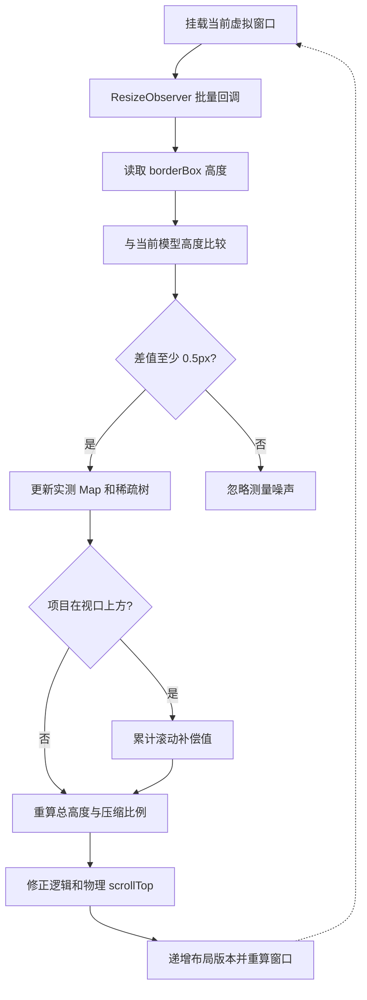

# React 长列表滚动卡顿解决方案

本目录参考 Vue 版本的功能，用 React 18 重新实现固定高度与不定高度虚拟列表。现有`height-fixed`、`height-auto` 页面继续保留，便于对比不同实现。

## 目录职责

```text
long-list-ui-lag/
├── core/                    # 与 Vue、React 无关的纯 TypeScript 算法
├── shared/                  # 公共演示数据和数据规模控件
├── fixed-height/            # 固定高度 React Hook 与页面
├── dynamic-height/          # 不定高度 React Hook 与页面
└── style.module.scss        # 两个页面共用的视觉样式
```

`core` 不导入 React，可以直接被 Vue 页面、React 页面、单元测试或其他前端框架复用：

- `FixedHeightVirtualizer`：通过除法以 O(1) 计算渲染区间和偏移。
- `DynamicHeightVirtualizer`：使用预估高度和稀疏 Fenwick Tree，以 O(log n) 更新高度、查询累计偏移和定位项目。
- `estimateItemHeight`：根据内边距、标题、预计正文行数、行高和边框计算未测量项目的初始基线。
- `scroll-coordinate`：负责百万级列表的物理/逻辑滚动坐标压缩及渲染偏移换算。

## React 层实现

固定高度页面将高频 `scroll` 事件先写入 `ref`，再由 `requestAnimationFrame` 每帧最多提交一次
React 状态。滚动越快，`overscan` 越大，但始终限制在 6 至 28 条，避免快速滚动白屏或突然创建
大量 DOM。

不定高度页面只通过一个 `ResizeObserver` 测量当前渲染的少量节点。实测高度批量写入 Fenwick
Tree；当视口上方项目高度发生变化时，同步补偿滚动位置，避免正在阅读的内容跳动。
滚动容器只使用 passive `scroll` 监听，并通过 `overscroll-behavior: contain` 隔离滚动链；不注册
非 passive `wheel` 监听，避免滚轮输入等待主线程处理而产生卡顿。

动态演示每 4 条记录包含 1 张图片，并交替演示两种占位策略：一类在数据中提供 HTML `width`、
`height` 固有尺寸，另一类不提供宽高，只提供 CSS `aspect-ratio`。两种方式都能在图片下载前预留
布局空间。统一预估高度按图片出现概率加入平均媒体占位，图片挂载后仍由 ResizeObserver 校验最终
真实高度。

两种页面的选择状态都使用完整列表项目的稳定 `id` 保存在独立 `Set` 中，不依赖当前 DOM。列表项
滚出虚拟窗口后可以被正常销毁，再次滚回时仍会恢复选择状态；选择按钮采用固定尺寸，状态变化不会
干扰动态行高测量。

固定高度和不定高度页面都不会创建与总数等长的数据数组，只根据当前虚拟区间即时生成几十条
演示数据。不定高度模型也只保存已渲染项目的实测高度和对应的稀疏 Fenwick 增量节点，因此可以
选择 500 万、1,000 万、2,000 万、5,000 万、1 亿和 10 亿条逻辑数据。

当完整逻辑高度超过浏览器安全范围时，DOM 占位高度限制为 8,000,000px，并将物理
`scrollTop` 映射为完整逻辑坐标。两个页面都能定位超大逻辑列表中的末尾项目，同时不会把数百亿
像素直接写入 DOM 高度和 `transform`。

## 页面地址

```text
/virtual-list/long-list-ui-lag/fixed-height
/virtual-list/long-list-ui-lag/dynamic-height
```

## 生产环境取舍

本演示的数据可由索引推导，因此不需要真实存储十亿条对象；实际业务数据仍会产生接口传输和内存
成本。固定高度优先使用本目录的简单模型；涉及动态高度、吸顶、反向列表或复杂滚动恢复时，应
优先评估 TanStack Virtual。服务端数据超过约 1,000 条时，通常还应结合搜索、筛选、分页或游标加载。

---

## 设计详解

本目录参考 Vue 版本的功能，用 React 18 实现固定高度与不定高度虚拟列表，并将区间计算、高度
索引和滚动坐标换算抽离为框架无关的 TypeScript。现有 `height-fixed`、`height-auto` 页面继续
保留，用于和本方案对比。

本文重点说明这套方案解决什么问题、为什么这样拆分、数据如何流动，以及核心代码分别承担什么
职责。面试话术另见 [interview.md](./interview.md)。

### 1. 要解决的问题

长列表卡顿不是单一的 React 渲染问题，而是下面几类成本叠加：

1. **DOM 数量随数据量增长**：一次挂载数万节点会占用大量内存，并增加 React reconciliation、
   Style、Layout 和 Paint 成本。
2. **滚动事件频率高**：直接在每次 `scroll` 中调用 `setState`，可能在一帧内触发多次无效更新。
3. **不定高度无法提前定位**：未挂载的 DOM 没有真实高度，但滚动条、首屏区间和偏移量又必须先算。
4. **异步内容改变高度**：图片、字体和内容换行会在挂载后修正行高，引起列表总高度和当前阅读位置
   变化。
5. **浏览器存在元素高度上限**：十亿级逻辑数据即使不创建十亿个对象，`itemCount × itemHeight`
   形成的数百亿像素高度也不能直接交给 DOM。
6. **行内状态不能依赖 DOM 生命周期**：虚拟行滚出窗口后会卸载，选择状态如果保存在行组件中就会
   丢失。

这套实现的目标不是“把十亿条真实业务数据一次加载到浏览器”，而是让 **DOM、测量缓存和 React
更新成本不再与逻辑总条数线性绑定**。

### 2. 设计原则

| 设计原则                  | 实现方式                                            | 解决的问题                                |
| ------------------------- | --------------------------------------------------- | ----------------------------------------- |
| 只渲染需要看到的内容      | 视口区间加 overscan                                 | 控制 DOM、布局和绘制成本                  |
| 高频输入与 React 更新解耦 | `scroll → ref → requestAnimationFrame → state` | 一帧最多提交一次滚动状态                  |
| 算法核心与框架解耦        | `core` 只使用 TypeScript                          | React、Vue、测试可复用同一算法            |
| 未知高度先估后测          | 统一预估高度加`ResizeObserver`                    | 首屏可计算，挂载后逐步逼近真实值          |
| 高度修正只保存差值        | 稀疏 Fenwick Tree                                   | O(log n) 更新、查询和定位，不创建亿级数组 |
| 阅读位置优先稳定          | 高度变化时进行滚动锚点补偿                          | 视口上方内容变化不推动当前内容跳动        |
| 区分浏览器坐标与业务坐标  | 物理/逻辑滚动坐标压缩                               | 避免超大 DOM 高度和 transform             |
| 业务状态独立于虚拟窗口    | 稳定`id` 加外部 `Set`                           | 行卸载、重建后仍保留选择状态              |

### 3. 目录与职责边界

```text
long-list-ui-lag/
├── core/
│   ├── fixed-height-virtualizer.ts    # 固定高 O(1) 区间计算
│   ├── dynamic-height-virtualizer.ts  # 稀疏高度索引与 O(log n) 定位
│   ├── item-height-estimator.ts       # 未测量项目的统一预估高度
│   ├── scroll-coordinate.ts           # 物理/逻辑滚动坐标换算
│   └── types.ts                       # 框架无关的区间和坐标类型
├── fixed-height/
│   ├── use-fixed-height-list.ts       # 固定高 React 状态与滚动调度
│   └── index.tsx                      # 固定高页面和 memo 行组件
├── dynamic-height/
│   ├── use-dynamic-height-list.ts     # DOM 测量、锚点补偿和 React 调度
│   └── index.tsx                      # 不定高页面和图片渲染
├── shared/
│   ├── demo-data.ts                   # 按索引即时生成演示数据
│   └── data-size-select.tsx           # 数据规模切换控件
├── style.module.scss                  # 两个页面共用样式
├── interview.md                       # 面试回答手册
└── readme.md                          # 设计与实现文档
```

`core` 不导入 React，也不读取 DOM。它只接收数字并返回区间或坐标，所以可以直接被 Vue、React、
Web Worker、单元测试或其他运行环境复用。React Hook 只负责浏览器事件、组件状态和观察器生命周期。

### 4. 整体数据流

```mermaid
flowchart LR
    user[/滚动输入/]
    scrollHandler[记录物理 scrollTop]
    frame[下一绘制帧]
    coordinate[换算逻辑 scrollTop]
    heightMode{高度模式}
    fixedModel[固定高公式]
    dynamicModel[稀疏高度模型]
    range[计算虚拟区间]
    data[按索引生成窗口数据]
    reactView[渲染少量 React 行]
    observer[测量真实行高]
    correction[修正高度差与滚动锚点]

    user --> scrollHandler
    scrollHandler --> frame
    frame --> coordinate
    coordinate --> heightMode
    heightMode -->|固定高| fixedModel
    heightMode -->|不定高| dynamicModel
    fixedModel --> range
    dynamicModel --> range
    range --> data
    data --> reactView
    reactView -.->|仅不定高| observer
    observer --> correction
    correction -.-> dynamicModel
```



关键点是：滚动事件不直接创建数据或逐次触发 React 更新；核心模型也不保存完整业务数组。每一帧
只根据最新逻辑位置计算一个 `[startIndex, endIndex)`，再为这个窗口即时生成几十条数据。

页面 DOM 始终保持下面的三层结构：

```text
viewport                         # 真正的滚动容器
└── spacer                       # 只负责撑开安全范围内的滚动条
    └── visibleList              # transform 到当前窗口位置
        ├── row
        ├── row
        └── row                  # 仅视口附近的少量节点
```

### 5. 固定高度方案

#### 5.1 区间计算

固定高度已知为 `itemHeight`，可以直接计算：

```text
firstVisibleIndex = floor(logicalScrollTop / itemHeight)
visibleCount      = ceil(viewportHeight / itemHeight)
startIndex        = max(0, firstVisibleIndex - overscan)
endIndex          = min(itemCount, firstVisibleIndex + visibleCount + overscan)
offsetY           = startIndex × itemHeight
totalHeight       = itemCount × itemHeight
```

这些计算都是 O(1)，因此只要业务允许固定行高，应优先选择固定高度方案。

核心实现摘要：

```ts
const firstVisibleIndex = Math.floor(scrollTop / itemHeight);
const visibleCount = Math.ceil(viewportHeight / itemHeight);
const startIndex = Math.max(0, firstVisibleIndex - overscan);
const endIndex = Math.min(
    itemCount,
    firstVisibleIndex + visibleCount + overscan,
);

return {
    startIndex,
    endIndex,
    offsetY: startIndex * itemHeight,
    totalHeight: itemCount * itemHeight,
};
```

对应代码：[core/fixed-height-virtualizer.ts](./core/fixed-height-virtualizer.ts)。

#### 5.2 为什么使用动态 overscan

固定高页面根据上一帧到当前帧的逻辑滚动距离调整缓冲条数：慢速时保留 6 条，高速时最多 28 条。

```ts
const distance = Math.abs(nextScrollTop - previousScrollTop);
const overscan = Math.min(28, 6 + Math.ceil(distance / itemHeight));
```

固定 overscan 太小会在快速滚动时短暂白屏，始终过大又会创建不必要的 DOM。按帧内位移动态调整，
是在响应速度与渲染成本之间做有限度的折中。

### 6. 不定高度方案

#### 6.1 为什么必须先预估

DOM 未挂载时无法读取真实高度，但首次渲染前已经需要计算滚动条总高度和可见区间。因此未测量项先
使用代表性预估值，挂载后再由 `ResizeObserver` 写回真实高度。

当前预估高度由可解释的布局参数组成：

```text
上下 padding                         32px
标题 line-height                    17px
标题下间距                           7px
平均正文 6.5 行 × 22px             143px
下边框                               1px
25% 图片概率 × (180px + 12px)       48px
字体取整和缩放安全余量                5px
-----------------------------------------
统一预估高度                         253px
```

图片不是每条都有，所以媒体高度不能直接加 192px，而要按出现概率折算为每条记录的平均占位。预估
值只决定冷启动质量，不承担最终正确性；真实高度仍会持续修正。

对应代码：[core/item-height-estimator.ts](./core/item-height-estimator.ts) 和
[dynamic-height/use-dynamic-height-list.ts](./dynamic-height/use-dynamic-height-list.ts)。

#### 6.2 为什么使用稀疏 Fenwick Tree

如果维护普通前缀和数组，一项高度变化后需要更新它后面的所有累计值，单次更新是 O(n)。Fenwick
Tree 可以将单项更新和前缀查询降为 O(log n)，并通过 binary lifting 在 O(log n) 内根据滚动偏移
定位项目。

完整的 lowbit 推导、节点覆盖范围、更新/查询路径、binary lifting 手算和稀疏差值模型，参见
[core/fenwick-tree.md](./core/fenwick-tree.md)。

本实现没有创建长度为 `itemCount` 的树数组，而只保存相对统一预估高度的差值：

```text
prefixHeight(index)
= index × estimatedItemHeight
+ measuredDeltaPrefix(index)
```

```ts
getOffset(index) {
    return index * estimatedItemHeight + queryMeasuredDelta(index);
}

updateItemHeight(index, actualHeight) {
    const delta = actualHeight - previousHeight;
    measuredHeights.set(index, actualHeight);
    addToSparseTree(index + 1, delta);
}
```

因此 10 亿条未浏览数据只表现为一个 `itemCount` 数字；内存主要取决于已经测量过多少项目，而不是
完整逻辑总数。稀疏 Map 中一次高度更新最多写入 O(log n) 个 Fenwick 节点。

#### 6.3 实测与滚动锚点补偿流程



如果发生高度变化的项目位于当前逻辑 `scrollTop` 上方，就把高度差累计到滚动位置：

```text
nextLogicalScrollTop = currentLogicalScrollTop + scrollCompensation
```

否则列表顶部累计高度变化会推动当前内容上下跳动。位于视口内部或下方的项目只修正高度模型，不
补偿当前位置。页面停在底部时则优先保持贴底状态。

### 7. 滚动热路径为什么使用 ref 和 rAF

浏览器可能在一帧内派发多次 `scroll`。如果每次事件都立即 `setState`，React 会处理已经过时的中间
位置。本实现只把最新物理和逻辑坐标写入 ref，并保证同一帧最多注册一个回调：

```ts
latestPhysicalScrollTopRef.current = viewport.scrollTop;
latestLogicalScrollTopRef.current = toLogicalScrollTop(...);

if (!frameIdRef.current) {
    frameIdRef.current = requestAnimationFrame(commitScroll);
}
```

下一帧只提交最后一次位置。不定高页面使用 passive 原生 `scroll` 监听；固定高页面的 React
`onScroll` 同样不调用 `preventDefault()`。边界滚动隔离由 CSS `overscroll-behavior: contain`
处理，避免注册会阻塞滚轮输入的非 passive `wheel` 监听。

### 8. 为什么需要物理/逻辑滚动坐标

对于 10 亿条、平均 253px 的不定高数据，逻辑总高度约为 2,530 亿像素。浏览器无法可靠维护这么
高的单个 DOM 元素，因此实现中区分：

- **逻辑坐标**：完整数据空间的位置，用于算法查询和项目定位。
- **物理坐标**：浏览器真实 `scrollTop`，占位高度最多为 8,000,000px。

```text
physicalTotalHeight = min(logicalTotalHeight, 8,000,000)
scrollScale = logicalScrollable / physicalScrollable
logicalScrollTop = physicalScrollTop × scrollScale
```

顶部和底部使用显式边界判断，保证拖到滚动条末尾时能准确映射到完整列表末尾。可见窗口的 DOM
偏移也会重新放回物理滚动位置附近，避免给 `transform` 写入超大值：

```text
renderOffsetY
= physicalScrollTop - (logicalScrollTop - logicalRangeOffset)
```

坐标压缩解决的是浏览器几何上限，不代表浏览器真的加载了十亿条对象。

### 9. 图片加载与不定高度

动态演示每 4 条记录包含一张图片，并交替展示两种加载前占位策略：

```ts
type DynamicDemoImage =
    | {
        layout: 'dimensions';
        width: number;
        height: number;
      }
    | {
        layout: 'aspect-ratio';
        aspectRatio: string;
      };
```

- `dimensions`：接口知道原图尺寸时，使用 HTML `width`、`height` 建立固有比例。
- `aspect-ratio`：卡片比例由产品规范确定时，不传 HTML 宽高，只设置 CSS `aspect-ratio`。

两种字段由可辨识联合类型约束为互斥，避免 `width/height` 与 `aspectRatio` 配置冲突。图片还使用
`loading="lazy"` 和 `decoding="async"`，减少视口外下载及同步解码压力。即使图片请求失败，加载前
预留的几何空间仍然存在；最终实际行高继续由 `ResizeObserver` 校验。

### 10. 数据与状态设计

#### 10.1 不创建完整演示数组

数据规模切换只保存 `itemCount`。每次拿到虚拟区间后，才通过索引生成当前窗口数据：

```ts
createDataRange(startIndex, endIndex, createItem);
```

因此从 10,000 切换到 10 亿，不会创建 10 亿个 JavaScript 对象。真实项目不能由索引推导时，仍应
结合服务端分页、游标加载、搜索和分段缓存。

#### 10.2 选择状态为什么保存在外层

虚拟行会频繁卸载和重建，所以选择状态使用稳定业务 `id` 保存在 Hook 的 `Set<number>` 中：

```ts
setSelectedIds((current) => {
    const next = new Set(current);
    next.has(id) ? next.delete(id) : next.add(id);
    return next;
});
```

函数式更新避免并发状态覆盖；创建新 Set 能让 React 正确识别引用变化。行重新进入窗口后，通过
`selectedIds.has(item.id)` 恢复状态。行组件使用 `React.memo`，其他行的选择变化不会迫使所有历史
数据重新渲染。

### 11. 核心模块实现摘要

| 模块                                                                   | 核心输入                          | 核心输出                     | 设计原因                       |
| ---------------------------------------------------------------------- | --------------------------------- | ---------------------------- | ------------------------------ |
| [`FixedHeightVirtualizer`](./core/fixed-height-virtualizer.ts)        | 高度、滚动位置、视口、条数        | `VirtualRange`             | 固定高可用 O(1) 数学公式       |
| [`DynamicHeightVirtualizer`](./core/dynamic-height-virtualizer.ts)    | 预估高度、实测高度、滚动位置      | 区间、偏移、总高度           | O(log n) 修正并避免线性扫描    |
| [`estimateItemHeight`](./core/item-height-estimator.ts)               | padding、行高、内容分布、媒体概率 | 统一预估高度                 | 冷启动值可解释、可根据样本校准 |
| [`scroll-coordinate`](./core/scroll-coordinate.ts)                    | 逻辑总高度、物理位置、视口高度    | 压缩比例、逻辑坐标、物理偏移 | 隔离浏览器高度上限             |
| [`useFixedHeightList`](./fixed-height/use-fixed-height-list.ts)       | 浏览器滚动和容器尺寸              | 固定高页面状态               | rAF 合帧与动态 overscan        |
| [`useDynamicHeightList`](./dynamic-height/use-dynamic-height-list.ts) | 滚动、尺寸和行高变化              | 不定高页面状态               | 管理观察器、锚点补偿和模型版本 |
| [`demo-data`](./shared/demo-data.ts)                                  | 逻辑索引和区间                    | 当前窗口业务对象             | 总量只保存数字，数据按需生成   |

两个模型统一返回下面的框架无关协议：

```ts
interface VirtualRange {
    startIndex: number;
    endIndex: number;
    offsetY: number;
    totalHeight: number;
}
```

React 层不关心核心内部使用除法还是 Fenwick Tree，只消费相同区间协议。这是固定高和不定高页面
可以共享渲染结构的关键。

### 12. 复杂度与资源占用

设完整逻辑数据量为 `n`，当前渲染窗口项目数为 `v`，已经测量过的项目数为 `m`：

| 操作             | 固定高度     | 不定高度                    |
| ---------------- | ------------ | --------------------------- |
| 计算区间         | O(1)         | O(log n)                    |
| 查询项目偏移     | O(1)         | O(log n)                    |
| 更新单项高度     | 不需要       | O(log n)                    |
| 生成窗口数据     | O(v)         | O(v)                        |
| React DOM 数量   | O(v)         | O(v)                        |
| 高度模型内存     | O(1)         | O(m log n) 的稀疏树节点上界 |
| 完整业务数据内存 | Demo 为 O(1) | Demo 为 O(1)                |

实际滚动性能仍受单行组件复杂度、图片解码、浏览器扩展、开发模式额外检查和主线程上的其他任务
影响。虚拟化只减少列表相关工作量，不会消除所有主线程长任务。

### 13. 为什么没有直接使用其他方案

| 方案                      | 优点                             | 局限                                      | 本项目选择                   |
| ------------------------- | -------------------------------- | ----------------------------------------- | ---------------------------- |
| 全量渲染                  | 实现最简单，浏览器查找和打印自然 | DOM、内存和布局成本随 n 增长              | 仅适合少量数据               |
| 分页                      | 每页成本稳定，服务端容易控制     | 翻页打断连续浏览                          | 真实业务仍应配合使用         |
| 无限滚动                  | 交互连续，接口可分批请求         | 如果旧 DOM 不回收，最终仍然卡顿           | 应与虚拟化组合               |
| CSS`content-visibility` | 改造成本低，跳过部分视口外渲染   | DOM 和 React Fiber 仍然存在，超大列表不足 | 可作为中等数据量优化         |
| 成熟虚拟列表库            | 边界场景和生态更完整             | 需要理解库约束，核心算法不便跨框架展示    | 生产复杂场景优先评估         |
| 当前自研核心              | 设计透明、可测试、可跨框架复用   | 需要自行维护吸顶、反向列表等能力          | 用于原理验证和明确边界的业务 |

当需求包含复杂吸顶、双向加载、聊天列表、滚动恢复、网格虚拟化或 SSR 时，应优先评估 TanStack
Virtual、React Window 等成熟方案。自研的价值在于掌握数据流和解决当前明确问题，不是重复维护
成熟库的全部能力。

### 14. 边界与生产化建议

1. Demo 的十亿条数据由索引即时推导，不代表前端能够接收或保存十亿条真实业务记录。
2. 服务端数据超过约 1,000 条时，通常还应提供搜索、筛选、分页或游标接口。
3. 预估高度应在目标容器宽度下抽样 100～500 条真实数据，按内容类型和断点统计平均值、P50 或
   截尾平均值；当前 253px 只适用于本演示分布。
4. 图片应由接口返回固有尺寸，或由产品明确卡片比例；完全未知时只能依赖挂载后的二次测量。
5. 修改全局预估高度会改变所有未测量项目的逻辑位置，不能在滚动过程中无条件频繁调整。
6. 稀疏树内存随用户实际浏览和测量过的项目增长。长生命周期页面可根据产品需求增加分段淘汰或
   会话级缓存策略。
7. 生产验证应使用 Performance 面板关注主线程长任务、FPS、Layout、图片解码和 React commit，
   不能只看页面能否拖到十亿条末尾。

### 15. 页面地址

```text
/virtual-list/long-list-ui-lag/fixed-height
/virtual-list/long-list-ui-lag/dynamic-height
```

建议先在固定高页面观察 O(1) 区间和动态 overscan，再到不定高页面观察已测量数量、图片加载后的
高度修正、滚动锚点和超大数据下的滚动压缩比例。
